## Executive Summary

This analysis investigates what drives YouTube video performance and virality using a combination of historical trending data and live API data. We merged the Kaggle YouTube Trending Videos dataset (covering trending videos from November 2017 to June 2018) with current video statistics pulled from the YouTube Data API to create a longitudinal dataset of thousands ofunique videos. 

**Key Findings:**

- Early likes are the strongest predictor of both current view count (71% feature importance) and long term view growth (62% feature importance)
- Music dominates in total views but not in engagement rate — People & Blogs and Comedy have higher like-to-view ratios
- Most videos trend within 1-2 days of publishing; videos that don't trend within a week almost never do
- Random forest models predicting current views and view growth achieved R² scores of 0.679 and 0.669 respectively, while predicting time to trend proved harder (R² = 0.274), reflecting the inherent unpredictability of viral timing

## Project Context

**Motivation:**
YouTube is the world's largest video platform, yet the factors that drive a video to trend remain poorly understood. This project investigates whether early engagement signals can predict long term video success, and what content characteristics are associated with trending speed and view growth over time.

**Stakeholders:**

- Content creators seeking to optimize upload strategy
- Brands and marketers evaluating YouTube as an advertising channel
- Data science students interested in social media analytics

**Success Criteria:**

- Successfully merge Kaggle historical data with live YouTube API data
- Build reproducible cleaning and analysis pipelines as Python packages
- Train predictive models with interpretable feature importances
- Produce visualizations suitable for both technical and non-technical audiences

## Data Sources

- **Primary dataset:** [Kaggle YouTube Trending Videos Dataset](https://www.kaggle.com/datasets/datasnaek/youtube-new) — 40,949 rows of US trending video data from November 2017 to June 2018, including video metadata, tags, view/like/comment counts at time of trending
- **Supplementary data:** YouTube Data API v3 — used to fetch current view, like, and comment counts for each unique video ID in the Kaggle dataset
- **Data access notes:** Kaggle dataset is publicly available under CC0 license. YouTube API requires a Google Cloud API key with a daily quota of 10,000 units. Data was collected in April 2026.

## Methodology

### 1. Data Acquisition

The Kaggle dataset was downloaded programmatically using the `kagglehub` Python library. The YouTube Data API was queried using the `google-api-python-client` library, fetching video statistics in batches of 50 (the API maximum per request) across 128 total API calls to cover all 6,351 unique video IDs. Both datasets were loaded into pandas DataFrames and merged on `video_id`.

### 2. Cleaning Pipeline

The cleaning pipeline is implemented in `cleaning.py` and callable via `run_cleaning_pipeline()`. Key transformations include:

- Merged Kaggle and API DataFrames on `video_id` using an inner join, yielding 37,095 rows
- Renamed duplicate columns (`title_x/y`, `views_x/y`, `likes_x/y`) to descriptive names (`views_2017`, `views_current`, etc.)
- Converted `trending_date`, `publish_time`, and `published` to datetime objects
- 663 videos from the Kaggle dataset returned no API results, indicating they were deleted or made private since 2017

### 3. Analysis Workflow

The full analysis is implemented in `analysis.py` and callable via `run_analysis_pipeline(df)`. The workflow consists of two stages:

**Exploratory Data Analysis:**

- Growth analysis: computed view, like, and comment growth for each unique video
- Trending patterns: analyzed trending frequency by day of week and month
- Category analysis: compared average views and engagement rates across 15 content categories
- Time to trend: calculated days between publish date and first trending appearance

**Predictive Modeling:**

Three Random Forest regression models were trained using scikit-learn:

- **Model 1** — Predict current views from 2017 engagement metrics (likes, dislikes, comments, category). R² = 0.679
- **Model 2** — Predict time to trend from engagement and publish timing features. R² = 0.274  
- **Model 3** — Predict view growth (2017 to current) from initial engagement metrics. R² = 0.669

All continuous targets were log-transformed using `np.log1p()` to handle skewed distributions. An 80/20 train/test split was used with `random_state=42` for reproducibility.

### 4. Tooling

- `pandas`, `numpy` — data manipulation
- `google-api-python-client` — YouTube Data API v3
- `kagglehub` — Kaggle dataset download
- `scikit-learn` — Random Forest models, train/test split, evaluation metrics
- `matplotlib`, `seaborn` — visualizations
- `python-dotenv` — API key management
- Environment managed with `uv` and `.venv`
- Full pipeline reproducible via `run_cleaning_pipeline()` and `run_analysis_pipeline(df)`

## Results & Diagnostics

### EDA Findings

View growth is heavily right-skewed — a small number of music videos (Ed Sheeran's "Perfect", Maroon 5's "Girls Like You") grew by over 4 billion views since 2017, while the median video grew by about 1.6 million views. Trending frequency was uniform across days of the week, suggesting YouTube's algorithm does not favor any particular day. The dataset covers November 2017 through June 2018, so monthly patterns reflect dataset coverage rather than true seasonality.

Music dominated average current views at over 1 billion per video — roughly 10x the next category (Film & Animation). However, People & Blogs had the highest like rate at 2.8%, suggesting stronger audience loyalty despite lower absolute view counts. Most videos trended within 1-2 days of publishing, with a sharp dropoff after day 5.

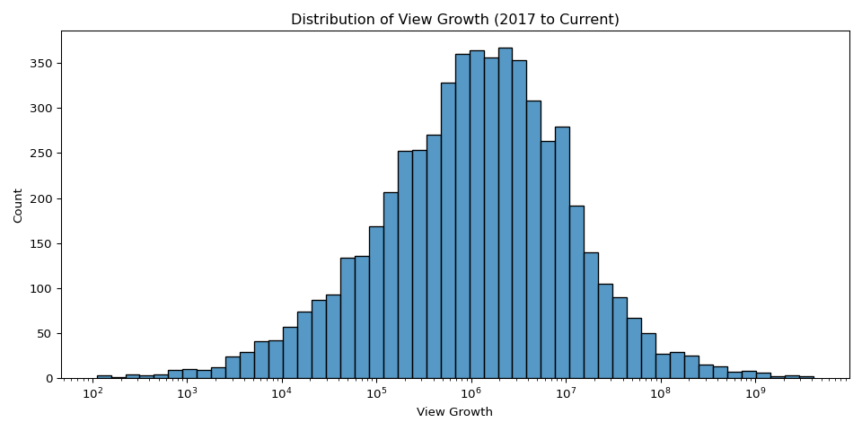

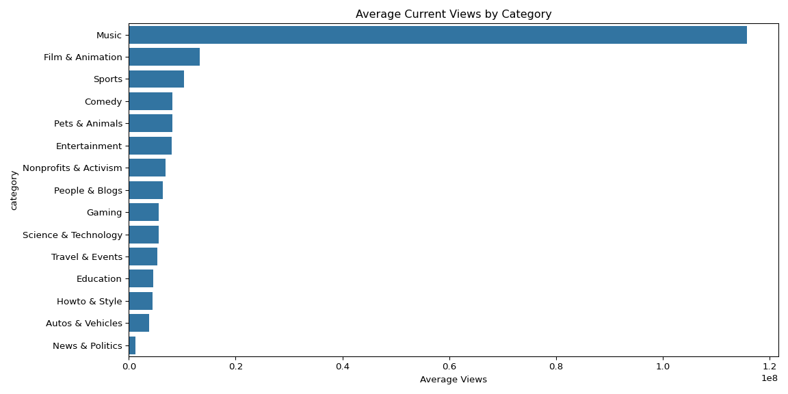

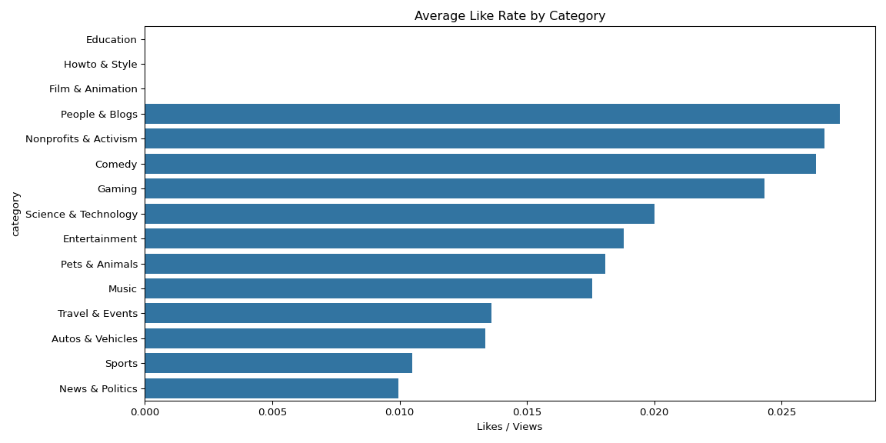

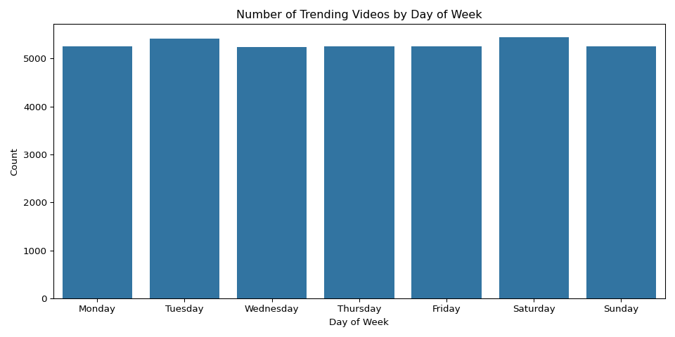

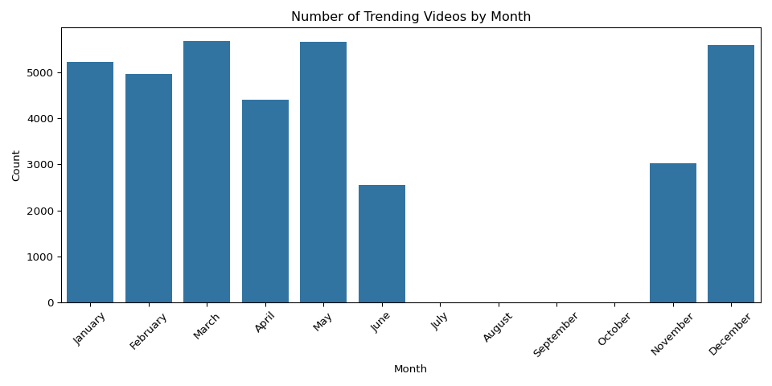

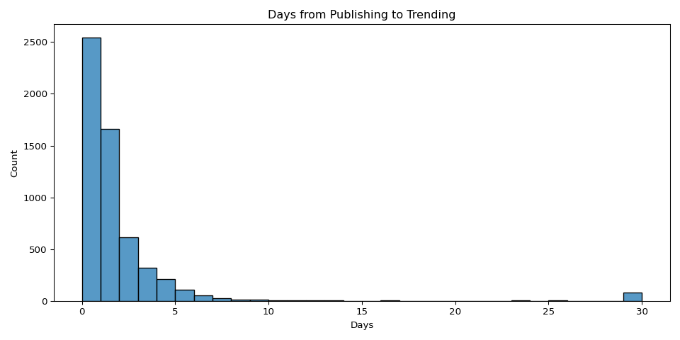

### Model Results

| Model | Target | R² | Top Feature |
|---|---|---|---|
| Model 1 | Current views | 0.679 | likes_2017 (71%) |
| Model 2 | Time to trend | 0.274 | comments_2017 (29%) |
| Model 3 | View growth | 0.669 | likes_2017 (62%) |

Models 1 and 3 performed similarly well, both explaining roughly 67-68% of variance. Model 2 performed worse, reflecting that viral timing contains significant randomness that early metrics cannot fully capture.

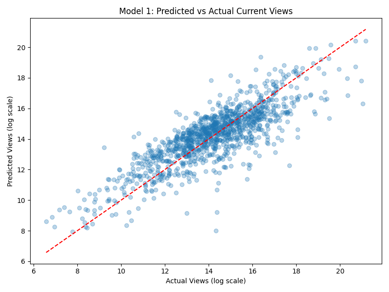
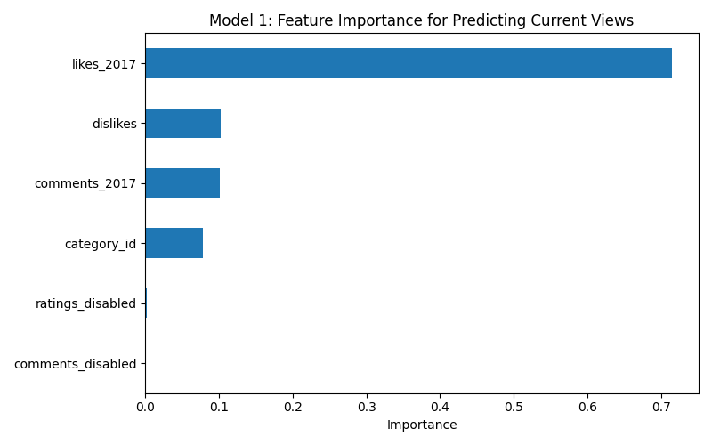

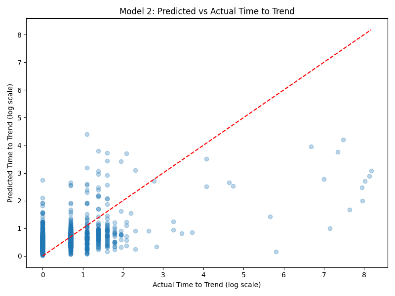
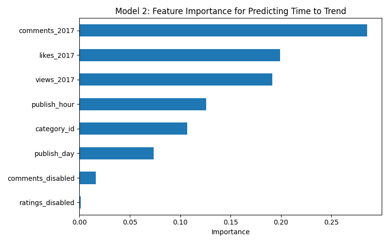

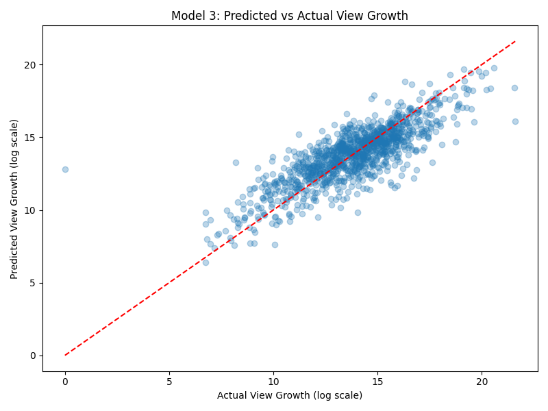
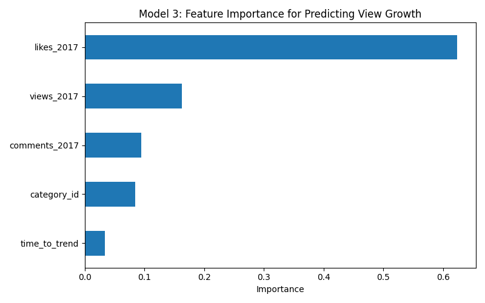

## Discussion & Next Steps

**Interpretation:**
The consistent dominance of early likes across both view prediction models suggests that YouTube's recommendation algorithm heavily weights initial engagement signals. This is actionable for creators — maximizing early engagement in the first 24-48 hours after upload appears to be the most important factor for long term success. The lower R² for time to trend (0.274) suggests that while engagement helps, there is significant luck involved in when exactly a video gets picked up by the trending algorithm.

**Limitations:**

- The Kaggle dataset only covers US trending videos from a 7-month window in 2017-2018, which may not reflect current YouTube algorithm behavior
- Videos deleted since 2017 are excluded, potentially introducing survivorship bias toward more successful content
- The dataset does not include thumbnail quality, title length, or description keywords, which may be important predictors
- Random Forest models are not easily interpretable beyond feature importance

**Future Directions:**

- Incorporate NLP features from titles, tags, and descriptions
- Analyze channel-level effects — do established channels trend faster than new ones?
- Build a time series model to track how individual video trajectories evolve over weeks and months
